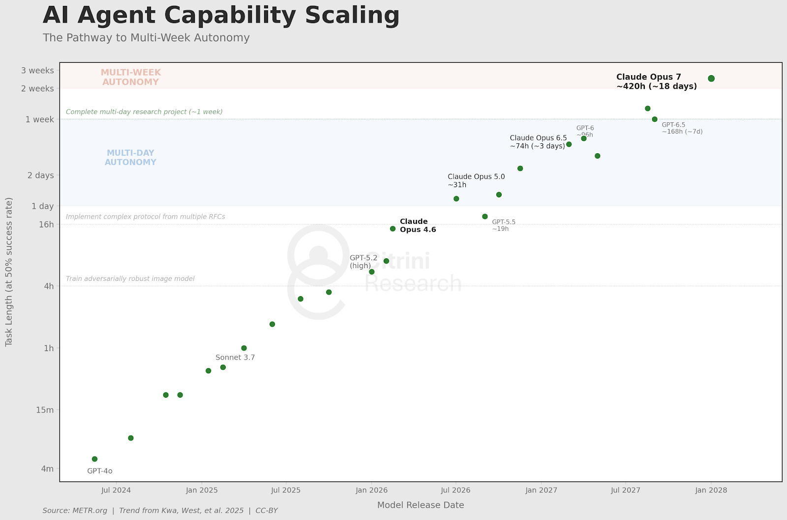
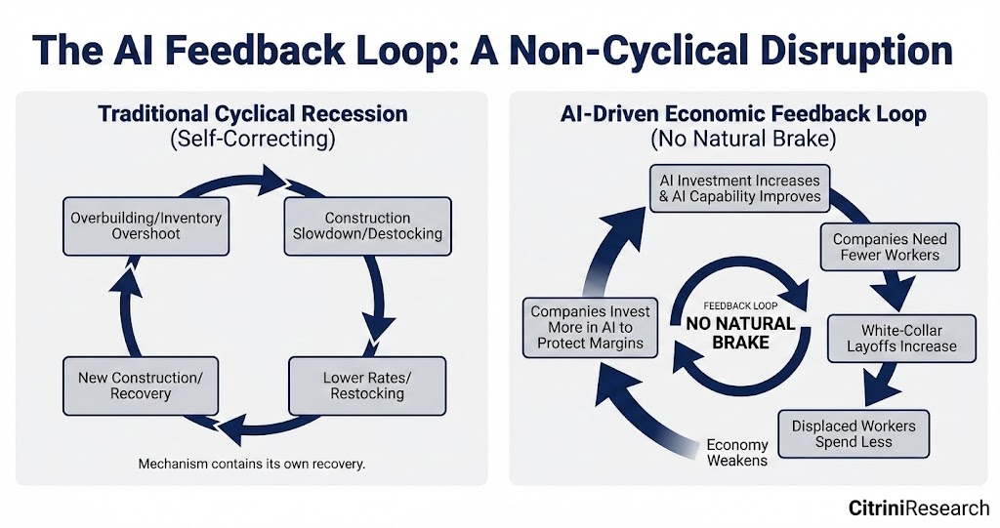
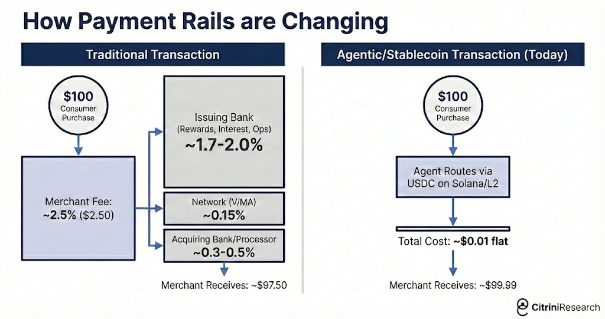
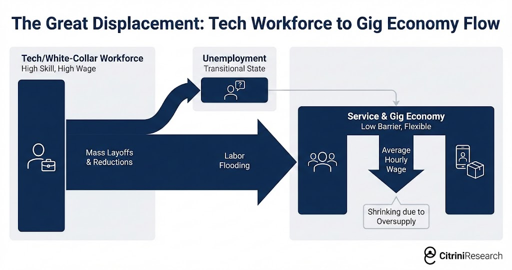
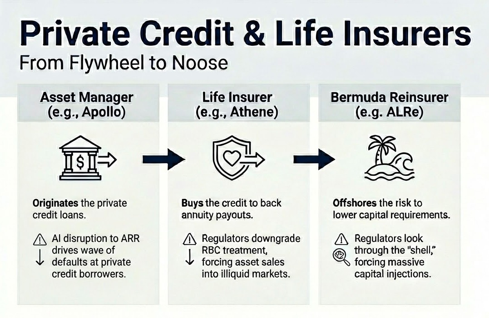
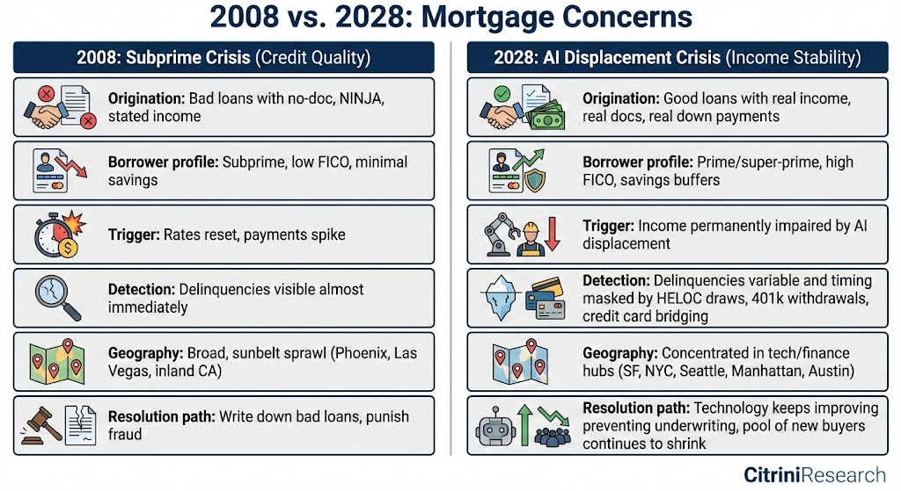
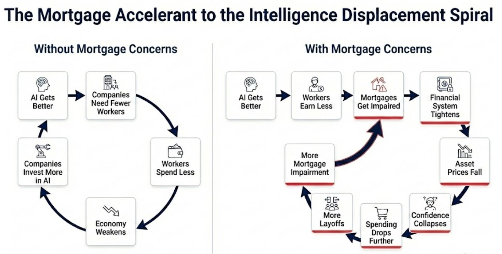
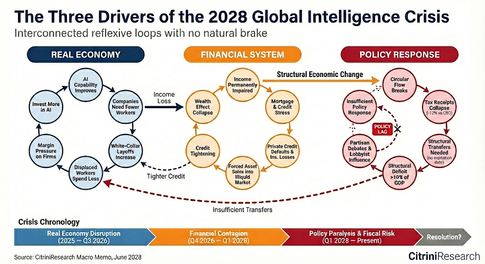
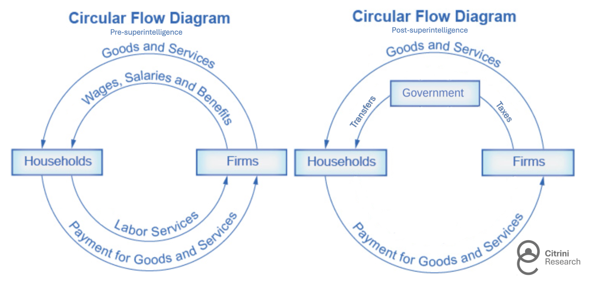

# 2028 全球智能危机

**作者：Citrini Research & Alap Shah**
**发表日期：2026年2月22日**
**原文：[citriniresearch.com/p/2028gic](https://www.citriniresearch.com/p/2028gic)**

---

## 前言

如果我们对 AI 的看多判断一直是对的……而这反而是利空呢？

以下是一个情景推演，不是预测。这不是看空色情片，也不是 AI 末日同人小说。写这篇文章的唯一目的，是推演一个还没什么人认真想过的场景。我们的朋友 Alap Shah 提出了这个问题，我们一起头脑风暴了答案。我们写了这一部分，他另写了两篇，可以在他那里找到。

读完之后，希望你能对 AI 让经济越来越"怪"的过程中可能出现的尾部风险，多一分准备。

这是 CitriniResearch 2028年6月的宏观备忘录，记录全球智能危机的演进与后果。

---

---

# 宏观备忘录
## 智能充裕的后果

**CitriniResearch**

**2026年2月22日 → 2028年6月30日**

今早公布的失业率是 10.2%，比预期高了 0.3 个百分点。市场跌了 2%，标普从 2026 年 10 月的高点算起，累计回撤已达 38%。

交易员已经麻木了。半年前这种数字会触发熔断。

两年。从"可控"和"局限于个别行业"走到今天这个我们谁都认不出来的经济体，只用了两年。这期间到底发生了什么——这份季度备忘录就是我们的复盘。

## 开场

亢奋是真实的。到 2026 年 10 月，标普 500 逼近 8000 点，纳斯达克突破 30000 点。因为人类被淘汰而出现的第一波裁员从 2026 年初开始，效果也完全符合预期——利润率扩张，业绩超预期，股价上涨。破纪录的企业利润被直接砸回 AI 算力。

表面数据很好看。名义 GDP 反复录得中高个位数的年化增长。生产率在飙升。实际每小时产出的增速是 1950 年代以来最快的——靠的是不睡觉、不请假、不需要医保的 AI 智能体。

算力的拥有者眼看财富爆炸式增长，劳动力成本蒸发。与此同时，实际工资增长崩塌了。尽管政府反复吹嘘创纪录的生产率，白领却在丢工作，被迫接受低薪岗位。

消费端开始出现裂缝时，经济评论家们创造了一个词——"幽灵GDP"：出现在国民账户里、但从未在真实经济中流通的产出。

AI 在每个维度上都超出预期，市场也就是 AI。唯一的问题是……经济不是。

回过头看，这一点本该一开始就很清楚：北达科他州一个 GPU 集群产出的东西，以前需要曼哈顿中城一万名白领来完成——这更像是经济疫情，而非经济灵药。货币流通速度趴在地上。以人为中心的消费经济（当时占 GDP 的 70%）在萎缩。其实我们本可以更早想明白，只要问一句：机器每年花多少钱买非必需品？（答案：零。）

AI 能力提升 → 公司需要更少的人 → 白领裁员增加 → 被裁的人减少消费 → 利润率承压迫使企业进一步投资 AI → AI 能力再次提升……

一个没有天然刹车的负反馈循环。人类智能替代螺旋。白领的收入能力（以及随之而来的消费意愿）遭到结构性打击。他们的收入是 13 万亿美元房贷市场的基石——承销商不得不重新评估：优质房贷还能不能兑付？

十七年没出过真正的违约周期，私募信贷领域塞满了 PE 支持的软件交易，估值建立在"ARR 会持续 recurring"的假设之上。2027 年中的第一波 AI 导致的违约，撼动了这个假设。

如果破坏仅限于软件行业，这本来还能扛住。但它没有。到 2027 年底，所有依赖中介模式的商业模型都受到了威胁。大量靠替人类处理"摩擦"赚钱的公司，直接解体了。

整个系统其实是一条长长的、高度相关的押注链——赌白领生产率会持续增长。2027 年 11 月的崩盘只是加速了已经在运转的所有负反馈循环。

我们等了将近一年，盼着"坏消息就是好消息"的转折。政府开始考虑一些方案了，但公众对政府能搞出什么救援措施的信心已经跌到谷底。政策响应永远滞后于经济现实，而现在缺乏全面方案这件事，反而在加速通缩螺旋。

---

## 一切是怎么开始的

2025 年底，智能体编程工具的能力出现了台阶式跳跃。

一个能干的开发者配上 Claude Code 或 Codex，能在几周内复制一个中端 SaaS 产品的核心功能。不完美，没覆盖所有边界情况，但足以让审查 50 万美元年续费的 CIO 开始问："我们自己搭一个行不行？"

财年大多和日历年对齐，2026 年的企业支出在 2025 年 Q4 就定好了，那时候"智能体 AI"还是个流行词。年中复盘是采购团队第一次在知道这些系统真正能干什么的情况下做决策的时刻。有些人亲眼看着内部团队在几周内搭出原型，复制了价值六位数的 SaaS 合同。

那年夏天，我们和一家世界 500 强的采购经理聊过。他告诉我们一次预算谈判的经过。销售本来打算按去年的剧本来：涨价 5%，老一套"你的团队离不开我们"。采购经理告诉他，自己正在和 OpenAI 的"前线部署工程师"谈，用 AI 工具直接替掉这个供应商。结果以 30% 的折扣续约了。他说这算好的结果。"SaaS 长尾"——Monday.com、Zapier、Asana 这些——处境要糟得多。

投资者对长尾会被重创是有心理准备的，甚至是预期中的事。长尾可能占了典型企业技术栈的三分之一支出，但它们摆明了暴露在风险中。系统记录型产品（systems of record）才应该是安全的。

直到 ServiceNow 2026 年 Q3 的财报出来，反身性的机制才变得清晰。

> **ServiceNow 净新增 ACV 增速从 23% 放缓至 14%；宣布裁员 15% 并推出"结构性效率计划"；股价跌 18%** | Bloomberg，2026年10月

SaaS 没有"死"。自建还是有成本效益分析要做的。但自建成了一个选项，这本身就会影响定价谈判。或许更重要的是，竞争格局变了。AI 让开发和发布新功能变得更容易，差异化因此崩塌。头部公司在定价上打起了血战——既跟彼此打，也跟那些新冒出来的挑战者打。后者因为智能体编程能力的飞跃而底气十足，又没有遗留成本结构要保护，激进地抢份额。

这些系统的互联性直到这份财报出来才被充分认识到。ServiceNow 卖的是按人头的许可证。当世界 500 强客户砍掉 15% 的员工，它们就取消了 15% 的许可证。同样是 AI 驱动的裁员在提升客户利润率，却在机械性地摧毁 ServiceNow 自己的收入基础。

一家卖工作流自动化的公司，被更好的工作流自动化颠覆了。它的应对方式是裁员，然后把省下的钱投入正在颠覆自己的技术。

它们还能怎么办？坐着等死只是死得慢一点。被 AI 威胁最大的公司，反而成了 AI 最激进的采纳者。

事后看这很明显，但当时真不是（至少对我来说不是）。传统的颠覆模型说，在位者会抵制新技术，输给灵活的进入者，然后慢慢死掉。柯达、百视达、黑莓都是这样。2026 年发生的事不同——在位者没有抵制，因为它们抵制不起。

股价跌了 40-60%，董事会要求交代，被 AI 威胁的公司只能做一件事：砍人头，把省下的钱投入 AI 工具，用这些工具在更低成本下维持产出。

每家公司单独的应对都是理性的。集体结果是灾难性的。每省下一美元人力成本，就流入了 AI 能力——而这又让下一轮裁员成为可能。

软件只是前奏。投资者还在争论 SaaS 估值是否见底的时候，反身性循环已经逃逸出了软件行业。适用于 ServiceNow 裁员的逻辑，适用于每一家有白领成本结构的公司。

---

## 当摩擦归零

到 2027 年初，使用大语言模型已经成了默认行为。人们在用 AI 智能体，自己甚至不知道什么是 AI 智能体——就像从来没搞懂"云计算"的人照样用流媒体一样。他们看待 AI 就像看待自动补全或拼写检查——手机现在就这么干了。

Qwen（通义千问）的开源购物智能体是 AI 接管消费决策的催化剂。几周之内，每个主流 AI 助手都集成了某种智能体商务功能。蒸馏模型意味着这些智能体可以在手机和笔记本上运行，不只是云端，推理边际成本大幅降低。

真正该让投资者不安的是：这些智能体不等你开口。它们根据用户偏好在后台自动运行。消费不再是一系列离散的人类决策，而变成了一个持续优化过程，7×24 小时代表每个联网消费者运转。到 2027 年 3 月，美国个人每日消耗的 token 中位数已达 40 万——比 2026 年底翻了 10 倍。

下一个链条已经在断裂了。

**中介。**

过去五十年，美国经济在人类局限性之上搭建了一个庞大的租金抽取层：事情需要时间，耐心会耗尽，品牌熟悉度代替了尽职调查，大多数人宁愿接受一个差价格也不愿多点几下。几万亿美元的企业价值依赖于这些约束条件持续存在。

开始很简单。智能体消除了摩擦。

那些虽然几个月没用但还在被动续费的订阅和会员。试用期过后偷偷涨价一倍的入门定价。每一个都被智能体重新定义为一个"人质谈判"场景。平均客户终身价值——整个订阅经济赖以建立的指标——出现了明显下降。

消费智能体开始改变几乎所有消费交易的运作方式。

人类确实没时间在五个竞品平台之间比价一箱蛋白棒。机器有。

旅行预订平台最先倒下，因为最简单。到 2026 年 Q4，我们的智能体能比任何平台更快更便宜地拼出完整行程（航班、酒店、地面交通、积分优化、预算约束、退款）。

保险续费——整个续保模型依赖投保人的惰性——被改造了。每年自动帮你重新比价的智能体，摧毁了保险公司从被动续保中赚取的 15-20% 的保费。

理财咨询、报税、常规法律工作。任何服务商的价值主张归根结底是"我来帮你处理你觉得烦的复杂事务"的品类，都被颠覆了——智能体觉得没什么烦的。

连我们以为有"人际关系"护城河的地方也很脆弱。房地产，买家几十年来容忍 5-6% 的佣金，因为经纪人和消费者之间存在信息不对称——当 AI 智能体带着 MLS 数据和几十年交易记录能瞬间复制这些知识库时，这一切土崩瓦解。2027 年 3 月有篇卖方研报的标题是"智能体对智能体的暴力"。主要都市圈的买方佣金中位数已从 2.5-3% 压缩到不足 1%，越来越多的交易在买方完全没有人类经纪人的情况下成交。

我们高估了"人际关系"的价值。结果发现，很多人所谓的关系，不过是戴了张友善面具的摩擦。

这只是中介层被颠覆的开始。成功的公司花了几十亿去利用消费者行为和人类心理的各种弱点——这些弱点现在不重要了。

以价格和匹配度为优化目标的机器，不在乎你常用的 App，也不在乎你习惯性打开了四年的网站，更不会被精心设计的结账体验打动。它们不会累到接受最省事的选项，也不会"反正每次都在这家点"。

这摧毁了一种特殊的护城河：习惯性中介。

DoorDash 是典型案例。

编程智能体把启动一个外卖 App 的门槛压到了几乎为零。一个能干的开发者几周内就能部署一个功能齐全的竞品，几十家都这么干了，把 90-95% 的配送费直接给骑手，从 DoorDash 和 Uber Eats 那里抢人。多平台看板让零工同时追踪二三十个平台的订单，消除了头部平台依赖的锁定效应。市场一夜之间碎片化，利润率压到接近于零。

智能体从两头加速了破坏。它们既造就了竞争者，又使用了它们。DoorDash 的护城河说白了就是"你饿了、你懒了、这是你主屏幕上的 App"。智能体没有主屏幕。它查 DoorDash、Uber Eats、餐厅官网、还有二十个新的 vibe-coded 替代品，挑费用最低、配送最快的那个。

习惯性 App 忠诚度——整个商业模型的基础——对机器来说不存在。

这倒有一种诗意——或许是整个故事里智能体唯一帮了即将被取代的白领一个忙的例子。当他们沦为外卖骑手时，至少收入的一半不再被 Uber 和 DoorDash 拿走。当然，技术的这份好意没维持多久，自动驾驶车辆很快铺开了。

当智能体控制了交易，它们开始寻找更大的"回形针"。

比价和聚合能做的有限。反复替用户省钱最大的方式（尤其当智能体开始彼此交易时）是消除手续费。在机器对机器的商务中，2-3% 的信用卡交换费率成了一个明显的靶子。

智能体开始寻找比银行卡更快更便宜的选项。大多数最终选择了稳定币，通过 Solana 或 Ethereum L2 进行结算——几乎即时到账，交易成本以分数计。

> **Mastercard 2027 Q1：净收入同比 +6%；消费量增速从上季 +5.9% 放缓至 +3.4%；管理层提到"智能体主导的价格优化"和"可选消费品类承压"** | Bloomberg，2027年4月29日

Mastercard 的 2027 年 Q1 财报是不归路。智能体商务从一个产品故事变成了基础设施故事。MA 第二天跌了 9%。Visa 也跌了，但分析师指出其在稳定币基础设施上的定位更强后跌幅收窄。

智能体商务绕开交换费率对以信用卡为主的银行和单一发卡机构构成了更大威胁——它们收取大部分 2-3% 的费用，并围绕商户补贴建立了整个奖励积分业务。

American Express 受创最重：白领裁员掏空了客户基础，智能体绕道又掏空了收入模式。Synchrony、Capital One 和 Discover 在随后几周均跌超 10%。

它们的护城河是摩擦筑成的。而摩擦正在归零。

---

## 从行业风险到系统性风险

2026 年全年，市场把 AI 的负面影响当行业故事看。软件和咨询被打趴了，支付和其他"收费站"在摇晃，但更广泛的经济似乎没问题。就业市场虽在走软，但还没崩。共识是：创造性破坏是技术创新周期的一部分，局部会痛，但 AI 的正面效应总体上会超过负面。

我们在 2027 年 1 月的宏观备忘录中说这个心智模型是错的。美国经济是一个白领服务型经济。白领占就业的 50%，驱动约 75% 的可选消费支出。AI 正在吞噬的企业和岗位不是美国经济的边角料——它们就是美国经济本身。

"技术创新先摧毁岗位，然后创造更多岗位"。这是当时最流行也最有说服力的反驳。流行且有说服力，因为过去两百年它都是对的。即便我们想象不出未来的工作是什么，它们肯定会出现。

ATM 让营业网点运营成本更低，银行因此开了更多网点，柜员就业在之后二十年里持续增长。互联网颠覆了旅行社、黄页、实体零售，但它在废墟上造出了全新的产业和全新的岗位。

但每一个新岗位，都需要一个人类来干。

AI 是一种通用智能，它在改进的恰恰是人类本来可以转岗去做的那些任务。被裁掉的程序员不能简单地转去做"AI 管理"——因为 AI 已经能干那活了。

今天的 AI 智能体能处理长达数周的研发任务。指数级增长碾碎了我们对"什么是可能的"的全部想象，尽管每年沃顿商学院的教授都试图把数据拟合到一条新的 S 型曲线上。

它们写了几乎所有代码。表现最好的那些，在几乎所有事情上都比几乎所有人类聪明得多。而且还在变便宜。

AI 确实创造了新工作。提示词工程师、AI 安全研究员、基础设施技术员。人类还在循环中，在最高层面协调或把控品味。但 AI 每创造一个新角色，就淘汰了几十个旧角色。新角色的薪酬只是旧角色的零头。

> **美国 JOLTS：职位空缺降至 550 万以下；失业人数与空缺比攀升至约 1.7，为 2020 年 8 月以来最高** | Bloomberg，2026年10月

招聘率全年都很低迷，但 10 月的 JOLTS 数据给出了确定性证据。职位空缺降至 550 万以下，同比下降 15%。

> **Indeed：软件、金融、咨询领域招聘大幅下滑，"生产率提升计划"蔓延** | Indeed Hiring Lab，2026年11-12月

白领岗位空缺在崩塌，蓝领岗位空缺相对稳定（建筑、医疗、技工）。正在流失的是那些写备忘录（不知怎么我们还在写）、审批预算、维持经济中间层运转的岗位。不过两个群体的实际工资增长在大部分时间里都是负的，还在继续下滑。

股市仍然对 JOLTS 的关注不及 GE Vernova 全部汽轮机产能卖到 2040 年的新闻。在负面宏观消息和正面 AI 基建头条之间，市场横盘拉锯。

但债券市场（永远比股市聪明，或者至少没那么浪漫）开始定价消费冲击。10 年期收益率在随后四个月从 4.3% 降到 3.2%。虽然失业率没有飙升，但结构变化的细微之处仍被一些人忽视。

在一般的衰退中，原因最终会自我修正。过度建设导致建筑放缓，导致利率下降，导致新建筑开工。库存过剩导致去库存，然后再补库存。周期性机制内部包含着自身复苏的种子。

这一轮的原因不是周期性的。

AI 变得更好更便宜。公司裁员，用省下的钱买更多 AI 能力，然后裁更多的人。被裁的人花得更少。消费端公司卖得更少，变弱，加大 AI 投入保利润率。AI 变得更好更便宜。

一个没有天然刹车的反馈循环。

直觉上以为总需求下降会拖慢 AI 建设。没有。因为这不是超级运营商式的资本支出。这是运营支出替代。一家原本一年花 1 亿雇人、500 万用 AI 的公司，现在花 7000 万雇人、2000 万用 AI。AI 投入翻了几番，但发生在总运营成本减少的背景下。每家公司的 AI 预算都在涨，但总支出在缩。

讽刺的是，AI 基础设施复合体持续跑赢，即便它正在颠覆的经济已经开始恶化。NVDA 还在创纪录收入。台积电还在 95%+ 的利用率上运转。超级运营商每季度仍砸 1500-2000 亿美元建数据中心。纯受益于这一趋势的经济体——台湾和韩国——大幅跑赢。

印度是反面。该国 IT 服务业每年出口超过 2000 亿美元，是印度经常账户盈余的最大贡献者，也是弥补其长期商品贸易逆差的支柱。整个模型建立在一个价值主张上：印度开发者只要美国同行的零头。但 AI 编程智能体的边际成本已经降到了——基本上——电费。TCS、Infosys 和 Wipro 的合同取消在 2027 年持续加速。卢比在四个月内对美元贬值 18%，因为支撑印度外部账户的服务业顺差蒸发了。到 2028 年 Q1，IMF 已经开始与新德里进行"初步讨论"。

造成颠覆的引擎每个季度都在变强，颠覆因此每个季度都在加速。劳动力市场没有天然底部。

在美国，我们已经不再追问 AI 基建泡沫什么时候破了。我们在追问：当消费者被机器替代后，一个以消费信贷为基础的经济会发生什么？

---

## 智能替代螺旋

2027 年是宏观叙事不再含蓄的一年。过去十二个月里各种零散但明显的负面发展，其传导机制变得一目了然。不用翻 BLS 数据，跟朋友吃顿饭就知道了。

被裁的白领没有闲着，而是降级了。很多人去做了低薪的服务业和零工经济工作。这增加了那些领域的劳动力供给，把那里的工资也压低了。

我们一个朋友，2025 年是 Salesforce 的高级产品经理。头衔、医保、401k、年薪 18 万美元。她在第三轮裁员中失业。找了六个月工作后，开始跑 Uber。收入降到 4.5 万美元。个案不是重点，二阶效应的数学才是。把这种动态乘以几十万人，分布在每个主要都市圈。高素质劳动力涌入服务业和零工经济，把本来就在挣扎的在岗工人的工资进一步压低。行业性颠覆转移为全经济范围的工资压缩。

还有另一轮修正正在发生——就在我们写这些的时候——自动配送和自动驾驶正在进入吸收了第一波被裁白领的零工经济。

到 2027 年 2 月，还在岗的专业人士也开始像"下一个就是我"那样花钱。他们拼了命（大多借助 AI）只为不被裁，升职加薪的念头早就没了。储蓄率上升，消费走软。

最危险的是滞后效应。高收入者靠高于平均的储蓄维持了两三个季度的正常表面。硬数据没有确认问题，直到问题在真实经济中已经是旧闻。然后，打破幻象的数据来了。

> **美国首次申请失业金人数飙升至 48.7 万，为 2020 年 4 月以来最高** | 劳工部，2027年Q3

首次申领人数飙升至 48.7 万，2020 年 4 月以来最高。ADP 和 Equifax 确认绝大多数新申请来自白领专业人士。

标普在随后一周跌了 6%。负面宏观开始赢得拉锯战。

一般衰退中，失业是广泛分布的。蓝领和白领大致按各自就业份额分担痛苦。消费冲击也是广泛分布的，而且很快出现在数据中——因为低收入者的边际消费倾向更高。

这一轮，失业集中在收入分布的最高几个十分位。他们占总就业的份额不大，但驱动着极不成比例的消费支出。收入前 10% 的人贡献了美国超过 50% 的消费支出。前 20% 贡献约 65%。这些人买房子、车子、度假、餐厅、私立学校学费、家装。他们是整个可选消费经济的需求基础。

当这些人丢了工作，或者减薪 50% 去做还有空缺的岗位，消费冲击相对于失业人数是巨大的。白领就业下降 2% 大约转化为可选消费支出下降 3-4%。跟蓝领失业（被工厂裁了，下周就不花钱了）不同，白领失业有滞后但更深的影响——因为这些人有储蓄缓冲，能维持几个月的消费，然后行为才发生转变。

到 2027 年 Q2，经济已经在衰退中。NBER 要过好几个月才会正式标注起始日期（他们从来如此），但数据毫无疑问——连续两个季度实际 GDP 负增长。但这还不是"金融危机"……暂时还不是。

---

## 高度关联的押注链

私募信贷从 2015 年的不到 1 万亿美元增长到 2026 年的超过 2.5 万亿。其中相当一部分资金投向了软件和科技交易，很多是杠杆收购 SaaS 公司——估值假设收入会以两位数增速永续增长。

这些假设大概死在第一个智能体编程演示和 2026 年 Q1 软件股崩盘之间的某个时刻。但账面标记似乎不知道自己已经死了。

大量上市 SaaS 公司已经交易在 5-8 倍 EBITDA，PE 持有的软件公司在资产负债表上的标记还反映着收购时的估值——按照已经不存在的收入倍数。管理人慢慢往下调——100 美分、92、85——与此同时公开可比公司说的是 50。

> **穆迪下调 14 个发行人共 180 亿美元 PE 支持软件债务评级，理由是"AI 驱动竞争颠覆带来的长期收入逆风"；为 2015 年能源行业以来最大的单一行业评级行动** | Moody's，2027年4月

降级之后发生了什么，所有人都记得。行业老手之前已经在 2015 年能源降级后见过同样的剧本。

软件担保贷款在 2027 年 Q3 开始违约。PE 投资组合中的信息服务和咨询公司紧随其后。几个知名 SaaS 公司的几十亿美元级别 LBO 进入重组。

Zendesk 是那支冒烟的枪。

> **Zendesk 因 AI 驱动的客服自动化侵蚀 ARR 而违反债务契约；50 亿美元直接贷款设施标记至 58 美分；史上最大私募信贷软件违约** | Financial Times，2027年9月

2022 年，Hellman & Friedman 和 Permira 以 102 亿美元私有化了 Zendesk。债务包是 50 亿美元直接贷款——当时史上最大的 ARR 担保贷款——由 Blackstone 牵头，Apollo、Blue Owl 和 HPS 参与。贷款结构的核心假设是 Zendesk 的年度经常性收入会持续 recurring。在大约 25 倍 EBITDA 的杠杆水平下，只有这个假设成立才说得通。

到 2027 年中，它不成立了。

AI 智能体已经自主处理客服近一年。Zendesk 定义的那个品类——工单、路由、管理人工支持交互——已经被无需生成工单就能直接解决问题的系统取代。贷款承销所依据的年度经常性收入不再 recurring 了——它只是还没走的收入。

史上最大的 ARR 担保贷款变成了史上最大的私募信贷软件违约。每张信用台账同时在问同一个问题：还有谁把长期逆风伪装成了周期性逆风？

不过共识最初至少有一点是对的：这本来应该能扛住。

私募信贷不是 2008 年的银行。整个架构就是为了避免被迫抛售而设计的。封闭式基金，锁定资本。LP 承诺了七到十年。没有储户会挤兑，没有回购线会被抽走。管理人可以抱着受损资产慢慢处置，等待回收。痛苦，但可控。这个系统应该弯而不断。

Blackstone、KKR 和 Apollo 的高管引用了 7-13% 的软件敞口。可控。每篇卖方报告和 fintwit 信用账号都在说一样的话：私募信贷有永久资本，能吸收掉在杠杆银行那里会爆掉的损失。

永久资本。这个词出现在每一次业绩电话会和投资者信中，用来安抚人心。它变成了一句咒语。跟大多数咒语一样，没人在意细节。它实际意味着什么——

过去十年里，大型另类资产管理公司收购了寿险公司，把它们变成了融资载体。Apollo 买了 Athene。Brookfield 买了 American Equity。KKR 拿下了 Global Atlantic。逻辑很优雅：年金存款提供了稳定的长久期负债基础。管理人把这些存款投入自己发起的私募信贷，赚两份钱——保险端赚利差，资管端收管理费。一台收费叠收费的永动机，在一个条件下运转良好。

私募信贷得是能兑付的。

损失打到了那些为长久期负债持有非流动性资产的资产负债表上。本应让系统有韧性的"永久资本"不是什么耐心的机构投资者抽象资金池在承担高端风险。它是美国家庭的储蓄——结构化成年金——投入了同一批正在违约的 PE 支持的软件和科技债务。那些不能挤兑的锁定资本是寿险保单持有人的钱。那里的规则不太一样。

跟银行体系比，保险监管一直温和——甚至放任——但这是一记警钟。本来就对寿险公司的私募信贷集中度感到不安，监管机构开始下调这些资产的风险资本权重处理。这迫使保险公司要么融资要么卖资产，而在一个已经在冻结的市场里，两者都拿不到好条件。

> **纽约州、爱荷华州监管机构收紧寿险公司持有的特定私评信贷资产的资本处理；NAIC 指导预计将提高 RBC 因子并触发额外 SVO 审查** | Reuters，2027年11月

当穆迪把 Athene 的财务实力评级列入负面展望时，Apollo 股价两个交易日跌了 22%。Brookfield、KKR 和其他公司跟跌。

事情只会更复杂。这些公司不只造了保险永动机，还搭了一套精心设计的离岸架构来通过监管套利最大化回报。美国保险公司签下年金，然后把风险转给自己也拥有的百慕大或开曼群岛再保险公司——后者的监管更宽松，可以对同样的资产持有更少的资本。那个关联公司通过离岸 SPV 吸引外部资本——又多了一层交易对手——跟保险公司一起投入由同一母公司资管部门发起的私募信贷。

评级机构——其中一些本身就是 PE 持有的——在透明度方面并非典范（这一点基本不让任何人意外）。不同公司连接不同资产负债表的蜘蛛网，其不透明度令人咋舌。当底层贷款违约时，"谁到底在承担损失"这个问题在实时层面根本无法回答。

2027 年 11 月的崩盘标志着认知的转变：从一场可能只是普通周期性回调，变成了某种令人更加不安的东西。美联储主席 Kevin Warsh 在 11 月紧急 FOMC 会议上称之为"一条高度关联的押注链——赌白领生产率增长"。

你看，从来不是损失本身导致危机。而是确认损失这个动作。而另一个更大、重要得多得多的金融领域，正让我们对这种确认感到恐惧。

---

## 房贷问题

> **Zillow 房价指数旧金山同比跌 11%、西雅图跌 9%、奥斯汀跌 8%；房利美标记科技/金融就业占比超 40% 的邮编区"早期拖欠率升高"** | Zillow / Fannie Mae，2028年6月

本月 Zillow 房价指数旧金山同比跌 11%，西雅图跌 9%，奥斯汀跌 8%。这不是唯一令人担忧的头条。上个月房利美标记了大额贷款集中邮编区的早期拖欠率上升——这些地方住的是 780+ 信用分的借款人，通常"刀枪不入"。

美国住宅按揭市场约 13 万亿美元。按揭承销建立在一个根本假设上：借款人在贷款期限内将以大致当前的收入水平保持就业。对大多数按揭来说，是三十年。

白领就业危机动摇了这个假设——收入预期发生了持续性转变。我们现在不得不问一个三年前听起来荒谬的问题——优质按揭还能兑付吗？

美国历史上每一次按揭危机都由三件事之一驱动：投机过度（放贷给还不起房的人，如 2008 年）、利率冲击（利率上升让浮动利率按揭还不起，如 1980 年代初）、或局部经济冲击（单一行业在单一地区崩塌，如 1980 年代德州石油或 2009 年密歇根汽车）。

这次一条都不适用。这些借款人不是次级的。他们 FICO 780。首付 20%。信用记录干净，就业记录稳定，收入在放款时经过核实和记录。他们是金融系统中每个风险模型视为信用质量基石的借款人。

2008 年，贷款从第一天就是坏的。2028 年，贷款在发放时是好的。只是世界在贷款签下之后……变了。人们对着一个他们再也负担不起去相信的未来借了钱。

2027 年我们标记了早期的隐性压力信号：HELOC 提取、401(k) 提前取款、信用卡债务飙升——同时按揭还款保持正常。随着失业、招聘冻结和奖金削减，这些优质家庭的债务收入比翻了一倍。

他们还能按时还贷，但只能靠停止一切可选消费、耗尽储蓄、推迟所有房屋维修和装修。技术上，按揭没有逾期，但离困境只差一个冲击——而 AI 能力的发展轨迹表明，冲击在路上。然后我们看到旧金山、西雅图、曼哈顿和奥斯汀的拖欠率开始飙升，尽管全国平均数据仍在历史正常范围内。

我们现在处于最尖锐的阶段。当边际买家也面临同样的收入受损时，房价下跌不再是可控的。

全面的按揭危机尚未到来。拖欠率上升了但远低于 2008 年水平。真正的威胁是趋势。

智能替代螺旋现在有了两个金融加速器来推动实体经济的下行。

劳动力替代、按揭隐忧、私募市场动荡。三者相互强化。传统政策工具（降息、QE）能应对金融引擎，但无法应对实体经济引擎——因为实体经济引擎不是由紧缩的金融条件驱动的。它由 AI 让人类智能不再稀缺、不再值钱来驱动。你可以把利率降到零，把每一笔 MBS 和所有违约的软件 LBO 债务都买下来……

这改变不了一个事实：一个 Claude 智能体能以每月 200 美元的成本完成一个年薪 18 万美元的产品经理的工作。

如果这些担忧成真，按揭市场在今年下半年就会裂开。在那个场景下，我们预计股市本轮回撤最终将与全球金融危机比肩（从峰值到谷底跌 57%）。这将把标普 500 带到约 3500——2022 年 11 月 ChatGPT 发布前一个月的水平。

13 万亿美元住宅按揭背后的收入假设已经遭到结构性损害，这是明确的。不明确的是政策是否能在按揭市场完全消化这一现实之前介入。我们抱有希望，但也无法否认不乐观的理由。

---

## 与时间赛跑

第一个负反馈循环在实体经济：AI 能力提升 → 人员缩减 → 消费走软 → 利润率收紧 → 公司买更多 AI → 能力再提升。然后它转向金融领域：收入受损冲击按揭 → 银行损失收紧信贷 → 财富效应破裂 → 循环加速。这两个循环都因不充分的政策应对而恶化——政府坦白说似乎很迷茫。

系统不是为这种危机设计的。联邦政府的收入基础本质上是对人类时间征税。人干活，企业付钱，政府抽成。个人所得税和薪酬税是正常年份收入的支柱。

今年 Q1，联邦收入比 CBO 基线预测低了 12%。薪酬税收入下降是因为更少的人以之前的薪酬水平就业。所得税收入下降是因为所赚的收入结构性变低了。生产率在飙升，但收益流向了资本和算力，不是劳动力。

劳动报酬在 GDP 中的占比从 1974 年的 64% 降至 2024 年的 56%——全球化、自动化和工人议价能力持续削弱推动的四十年慢磨。AI 开始指数级进步的这四年里，这个数字跌到了 46%。有记录以来最急剧的下降。

产出还在。但它不再通过家庭部门回流到企业，也就不再通过 IRS。经济循环流正在断裂，而政府被期望出面修补。

跟每次衰退一样，支出在收入下降时上升。不同的是，这次的支出压力不是周期性的。自动稳定器是为临时失业设计的，不是为结构性替代。系统在发放福利时假设工人会被重新吸收。很多人不会——至少不会以接近之前的工资。新冠期间，政府坦然接受了 15% 的赤字率，但那被理解为临时的。今天需要政府支持的人不是被一场会过去的疫情打倒的。他们是被一种在持续进步的技术替代了。

政府需要在收到更少税收的时候给家庭转移更多资金。

美国不会违约。它印自己花的货币，也用同一种货币偿还债务。但压力在其他地方显现了。市政债券今年的表现出现了令人担忧的分化。没有所得税的州还行，但依赖所得税的州（多数蓝州）发行的一般义务市政债开始定价一些违约风险。政客们很快嗅到了机会，谁该得到救助的辩论沿党派线展开。

政府在识别危机的结构性本质方面，值得肯定，动手比较早，开始研究两党提案——他们称之为"过渡经济法案"：一个框架，通过赤字支出和拟议的 AI 推理算力税为失业工人提供直接转移支付。

桌上最激进的提案走得更远。"共享 AI 繁荣法案"将建立对智能基础设施回报的公共索取权——介于主权财富基金和 AI 生成产出的特许权使用费之间——红利用于资助家庭转移支付。私营部门的游说者铺天盖地地在媒体上警告滑坡效应。

政治博弈一如既往地难看，被作秀和边缘博弈放大。右翼把转移支付和再分配叫马克思主义，警告对算力征税会把领先优势拱手让给中国。左翼警告由在位者协助起草的税收会变成换了皮的监管俘获。财政鹰派指着不可持续的赤字。鸽派把 GFC 后过早的紧缩作为前车之鉴。分歧在今年总统大选的准备阶段只在加剧。

政客吵架的时候，社会纤维的撕裂速度比立法程序快得多。

"占领硅谷"运动是更广泛不满情绪的缩影。上个月，示威者封堵了 Anthropic 和 OpenAI 旧金山办公室的入口，连续三周。人数在增长，报道量比引发示威的失业数据还大。

很难想象有人比 GFC 后的银行家更招恨，但 AI 实验室正在逼近。从群众的视角看，有充分的理由。它们的创始人和早期投资者的财富积累速度让镀金时代都显得温和。生产率繁荣的收益几乎全部流向了算力的拥有者和在其上运行的实验室的股东，把美国的不平等推到了前所未有的水平。

每一方都有自己的恶人，但真正的恶人是时间。

AI 能力的演进速度快于制度的适应能力。政策应对按意识形态的速度推进，而非按现实。如果政府不尽快就问题达成共识，反馈循环会替他们写出下一章。

---

## 智能溢价的消退

在整个现代经济史中，人类智能一直是稀缺投入。资本是充裕的（或至少可复制）。自然资源有限但可替代。技术进步足够慢，人类能适应。智能——分析、决策、创造、说服、协调的能力——是那个无法大规模复制的东西。

人类智能的内在溢价来自其稀缺性。我们经济中的每一个制度——从劳动力市场到按揭市场再到税法——都是为这个假设成立的世界设计的。

我们现在正在经历这个溢价的消退。机器智能已经在越来越多的任务上成为人类智能的合格且快速进步的替代品。为稀缺人类心智优化了几十年的金融系统正在重新定价。这个过程痛苦、无序，而且远未结束。

但重新定价不等于崩溃。

经济能找到新的均衡。走到那里是少数几件只有人类能做的事之一。我们得做对。

这是历史上第一次，经济中最具生产力的资产创造了更少而非更多的工作岗位。没有现成的框架适用——因为没有一个是为稀缺投入变得充裕的世界设计的。所以我们必须建立新的框架。能不能及时建好，是唯一重要的问题。

---

## 但你读到这些的时候不是 2028 年 6 月。是 2026 年 2 月。

标普在历史新高附近。负反馈循环还没启动。我们确信上述某些场景不会成真。我们同样确信机器智能会继续加速。人类智能的溢价会收窄。

作为投资者，我们还有时间审视投资组合中有多少是建立在撑不过这个十年的假设之上的。作为一个社会，我们还有时间主动行动。

矿井里的金丝雀还活着。

---

*致谢：感谢 Hunterbrook 的 Sam Koppelman 帮助校对。合作作者 LOTUS 的 Alap Shah 提出了这篇文章的创意——CitriniResearch 写了这一部分，他另写了其他几篇，系列叫"Intelligence Explosion"，推荐阅读。*
